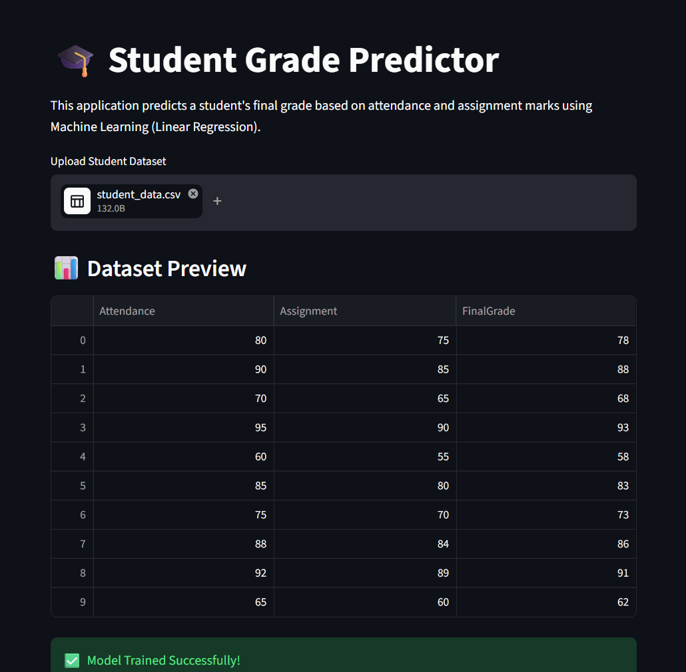

# Student Grade Predictor

## Developed By
Nikhil Sahu

## Overview
A Machine Learning project that predicts student grades based on attendance and assignment marks using Linear Regression.

## Technologies Used
- Python
- Pandas
- Scikit-learn
- Streamlit
- Matplotlib

## Features
- CSV Upload
- Grade Prediction
- Grade Classification
- Performance Analysis Chart

## Project Screenshot

